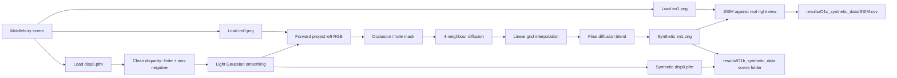

# O1 Pipeline Architecture

O1 负责从 Middlebury 场景的左图和参考视差生成一个深度感知的合成右视图。这个目录保存 O1 的 pipeline 说明和 PDF/报告用流程图；真正的合成场景写入 `results/O1b_synthetic_data/`，SSIM 汇总写入 `results/O1c_synthetic_data/SSIM.csv`。

## Processing Notes

- Input scenes are discovered from the configured Middlebury root and must contain `im0.png`, `im1.png`, and `disp0.pfm` for formal O1 synthesis.
- The reference disparity is not compressed into a toy range. It is cleaned, clipped to valid non-negative values, and lightly smoothed to reduce jagged projection boundaries.
- The left image is forward-projected according to disparity so nearer pixels overwrite farther pixels, which approximates stereo occlusion ordering.
- Projection holes are filled in three stages: local diffusion for thin cracks, interpolation for larger unresolved regions, then a short final diffusion pass to smooth boundaries.
- Per-scene outputs keep a dataset-like layout so later objectives can inspect or reuse them: `im0.png`, synthetic `im1.png`, `disp0.pfm`, copied `calib.txt` when available, and a scene README.

## Main Artifacts

- `results/O1a_synthetic_data/syn_pipeline.jpg`: PDF/visual pipeline asset.
- `results/O1b_synthetic_data/<scene>/im1.png`: synthesized right view.
- `results/O1b_synthetic_data/<scene>/disp0.pfm`: disparity used for synthesis.
- `results/O1c_synthetic_data/SSIM.csv`: scene-level quality summary comparing real and synthetic right views.