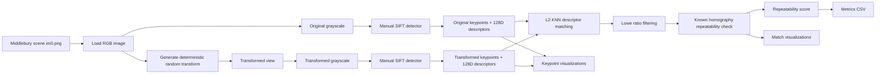
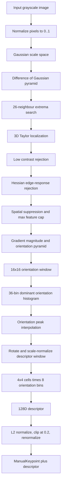

# O2 Pipeline Architecture

O2 评估手写 SIFT 在可控几何/亮度扰动下的 repeatability。这个 `a` 目录只保存 pipeline / architecture 说明；关键点图、匹配图和示例图写入 `results/O2b_sift/`，CSV 指标写入 `results/O2c_sift/`。

## Processing Notes

- Each scene uses `im0.png` as the source image, then creates a deterministic random transformed view from the scene name and index.
- The manual SIFT pipeline is implemented in `ManualSiftDetector`, not delegated to OpenCV. It builds a Gaussian / DoG scale space, localizes extrema, removes low-contrast and edge-like responses, assigns one or more dominant orientations, and computes 128-dimensional descriptors.
- Descriptor matching uses hand-written L2 KNN matching followed by Lowe ratio filtering.
- Repeatability is not judged by descriptor similarity alone. The known transform homography is used to verify that matched keypoints land within a fixed pixel threshold.
- The final repeatability value is `repeatable_matches / min(original_keypoints, transformed_keypoints)`, which avoids over-penalizing scenes where one side detects many more features.

## Manual SIFT Detail

### 1. Input normalization

The detector expects a single-channel grayscale image. If pixel values are larger than 1, the image is divided by 255 so the whole SIFT pipeline operates on a stable floating-point intensity range.

### 2. Scale-space construction

The implementation uses `base_sigma = 1.6`, `scales_per_octave = 3`, and at most four octaves. Within each octave, sigma grows by `k = 2^(1/3)`. Adjacent Gaussian layers are subtracted to form the DoG pyramid, which approximates the Laplacian-of-Gaussian response used for scale-invariant blob detection.

### 3. DoG extrema and keypoint localization

Each DoG sample is compared against 26 neighbours: eight in the same scale, nine in the previous scale, and nine in the next scale. Candidate points must pass a contrast floor derived from `contrast_threshold / scales_per_octave`. Each surviving candidate is refined with a 3D Taylor expansion over `(x, y, scale)`, solving for a sub-pixel and sub-scale offset. Candidates that move outside the local neighbourhood, fall below the refined contrast floor, or sit too close to the image border are rejected.

### 4. Edge-response rejection and spatial suppression

For each localized candidate, the code estimates the 2D Hessian on the DoG image and applies the SIFT principal-curvature test with `edge_threshold = 10`. This removes long edge responses whose localization is unstable along one direction. After that, a small engineering suppression step avoids keeping many nearly overlapping keypoints; candidates are processed by response strength and nearby duplicates are skipped before the `max_features` cap is reached.

### 5. Orientation assignment

For every retained candidate, gradients are read from the matching Gaussian scale layer. The local orientation stage uses a fixed `16x16` window. That window is first divided into `2x2` blocks; each block votes with its aggregate gradient vector. Very weak block gradients below `0.1 * local_max_magnitude` are ignored, remaining votes are Gaussian-weighted, and a circular 36-bin orientation histogram is smoothed. Peaks above `0.8` of the strongest peak are kept, so one physical location can produce multiple keypoints if it has multiple stable dominant orientations.

### 6. Descriptor construction

The descriptor window is rotated by the assigned keypoint angle and normalized by the candidate scale. Samples that land inside the normalized `16x16` support are accumulated into a `4x4` grid, with each cell storing an 8-bin orientation histogram relative to the keypoint angle. The flattened `4 * 4 * 8` vector gives the standard 128-dimensional SIFT descriptor. It is L2-normalized, clipped at `0.2` to reduce dominance by strong gradients, then normalized again.

### 7. Matching and repeatability scoring

Descriptors from the original image and transformed image are matched with Euclidean-distance KNN (`k = 2`). Lowe ratio filtering keeps a match only when the nearest neighbour is clearly better than the second nearest neighbour. For O2, this descriptor match is only a candidate: the known random transform homography projects the original keypoint into the transformed image, and the match is counted as repeatable only when the matched keypoint is within `4 px` of that projected location.

## Main Artifacts

- `results/O2a_sift/sift_pipeline.jpg`: PDF/visual pipeline asset.
- `results/O2a_sift/pipeline_architecture.md`: pipeline / architecture description.
- `results/O2b_sift/<scene>/im0_keypoints.png`: original image keypoint visualization.
- `results/O2b_sift/<scene>/im1_keypoints.png`: transformed image keypoint visualization.
- `results/O2b_sift/<scene>/keypoints_README.txt`: transform parameters and keypoint counts.
- `results/O2b_sift/<scene>/sift_matches.png`: repeatable match visualization.
- `results/O2c_sift/metrics.csv`: repeatability and match-count summary.
