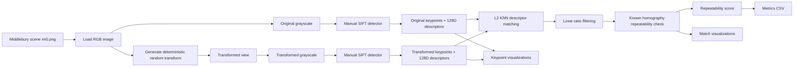

# O2 Pipeline Architecture

O2 评估手写 SIFT 在可控几何/亮度扰动下的 repeatability。这个 `a` 目录只保存 pipeline / architecture 说明；关键点图、匹配图和示例图写入 `results/O2b_sift/`，CSV 指标写入 `results/O2c_sift/`。

## Processing Notes

- Each scene uses `im0.png` as the source image, then creates a deterministic random transformed view from the scene name and index.
- The manual SIFT pipeline builds scale space, detects DoG extrema, suppresses unstable candidates, assigns orientation, and computes 128-dimensional descriptors.
- Descriptor matching uses hand-written L2 KNN matching followed by Lowe ratio filtering.
- Repeatability is not judged by descriptor similarity alone. The known transform homography is used to verify that matched keypoints land within a fixed pixel threshold.
- The final repeatability value is `repeatable_matches / min(original_keypoints, transformed_keypoints)`, which avoids over-penalizing scenes where one side detects many more features.

## Main Artifacts

- `results/O2a_sift/pipeline_architecture.md`: pipeline / architecture description.
- `results/O2b_sift/<scene>/im0_keypoints.png`: original image keypoint visualization.
- `results/O2b_sift/<scene>/im1_keypoints.png`: transformed image keypoint visualization.
- `results/O2b_sift/<scene>/keypoints_README.txt`: transform parameters and keypoint counts.
- `results/O2b_sift/<scene>/sift_matches.png`: repeatable match visualization.
- `results/O2c_sift/metrics.csv`: repeatability and match-count summary.