# O3 Pipeline Architecture

O3 是传统 stereo depth baseline：用手写 SIFT 提供稀疏匹配先验，再用 census-gradient SGM 生成稠密视差，最后做 O3-style 后处理。这个 `a` 目录只保存 pipeline / architecture；正式视差、示例图和分析图写入 `results/O3b_disparity/`，指标写入 `results/O3c_disparity/`。

```mermaid
flowchart LR
    A[Middlebury stereo pair] --> B[Load im0.png / im1.png as grayscale]
    A --> C[Read calib + disparity hints]
    C --> D[Scene-adaptive disparity bounds]
    B --> E[Manual SIFT on left and right]
    E --> F[Descriptor KNN + ratio test]
    F --> G[Mutual and stereo-geometry filtering]
    G --> H[Sparse SIFT disparity seed prior]
    B --> I[Census + gradient cost volume]
    D --> I
    H --> I
    I --> J[Four-direction SGM aggregation]
    J --> K[Left / right disparity solve]
    K --> L[LR consistency + confidence margin]
    L --> M[Local disparity support mask]
    M --> N[Speckle removal]
    N --> O[Median + joint weighted median]
    O --> P[Short horizontal / vertical gap fill]
    P --> Q[Final dense disparity]
    Q --> R[results/O3b_disparity/<scene>/disp0.pfm]
    Q --> S[results/O3b_disparity/<scene>/disp0.png]
    Q --> T[results/O3c_disparity/metrics.csv]

    classDef input fill:#eaf3ff,stroke:#5a78b8,color:#1f365c,stroke-width:2px;
    classDef sparse fill:#edf6ea,stroke:#5e9b63,color:#244b26,stroke-width:2px;
    classDef calib fill:#fff2e2,stroke:#be884a,color:#77461a,stroke-width:2px;
    classDef dense fill:#f2ebff,stroke:#8361b0,color:#4d3375,stroke-width:2px;
    classDef post fill:#ffeaea,stroke:#bf6670,color:#7d2d36,stroke-width:2px;
    classDef output fill:#edf7f4,stroke:#4c8c79,color:#205545,stroke-width:2px;

    class A,B input;
    class C,D calib;
    class E,F,G,H sparse;
    class I,J,K dense;
    class L,M,N,O,P post;
    class Q,R,S,T output;
```

## Processing Notes

- O3 discovers official Middlebury scenes and estimates per-scene disparity bounds from calibration and image geometry, rather than relying only on a fixed global search range.
- Manual SIFT contributes reliable sparse stereo matches. These matches are converted into a seed disparity prior that guides the dense cost volume.
- The dense matcher uses a combined census and gradient cost volume, aggregates it with four-direction SGM, and solves both left-reference and right-reference disparities before LR filtering.
- Post-processing follows the same cleanup family now reused by O4: LR consistency, local support, speckle filtering, edge-aware median, joint weighted median, and short gap filling.
- `disp0.png` is only a colorized preview; `disp0.pfm` is the formal disparity artifact used for metrics.

## Node Classes

- `Input`: `Middlebury stereo pair`; `Load im0.png / im1.png as grayscale`
- `Sparse Prior`: `Manual SIFT on left and right`; `Descriptor KNN + ratio test`; `Mutual and stereo-geometry filtering`; `Sparse SIFT disparity seed prior`
- `Calibration & Bounds`: `Read calib + disparity hints`; `Scene-adaptive disparity bounds`
- `Dense Matching`: `Census + gradient cost volume`; `Four-direction SGM aggregation`; `Left / right disparity solve`
- `Post-processing`: `LR consistency + confidence margin`; `Local disparity support mask`; `Speckle removal`; `Median + joint weighted median`; `Short horizontal / vertical gap fill`
- `Output`: `Final dense disparity`; `results/O3b_disparity/<scene>/disp0.pfm`; `results/O3b_disparity/<scene>/disp0.png`; `results/O3c_disparity/metrics.csv`

## Main Artifacts

- `results/O3a_disparity/dep_pipeline.jpg`: PDF/visual pipeline asset.
- `results/O3a_disparity/pipeline_architecture.md`: pipeline / architecture description.
- `results/O3b_disparity/<scene>/disp0.pfm`: final O3 dense disparity.
- `results/O3b_disparity/<scene>/disp0.png`: colorized disparity preview.
- `results/O3b_disparity/<scene>/disparity_README.txt`: SIFT, SGM, disparity range, and postprocess metadata.
- `results/O3b_disparity/<scene>/error_map.png`: per-scene error visualization when ground truth is available.
- `results/O3c_disparity/metrics.csv`: MAE/RMSE/Bad-1px summary.