# O3 Pipeline Architecture

O3 是传统 stereo depth baseline：用手写 SIFT 提供稀疏匹配先验，再用 census-gradient SGM 生成稠密视差，最后做 O3-style 后处理。这个 `a` 目录只保存 pipeline / architecture；正式视差、示例图和分析图写入 `results/O3b_disparity/`，指标写入 `results/O3c_disparity/`。

```mermaid
flowchart LR
    A[Middlebury stereo pair] --> B[Load im0.png / im1.png as grayscale]
    A --> C[Read calib + disparity hints]
    C --> D[Scene-adaptive disparity bounds]
    B --> E[Manual SIFT on left and right]
    E --> F[Descriptor KNN + ratio test]
    F --> G[Mutual and stereo-geometry filtering]
    G --> H[Sparse SIFT disparity seed prior]
    B --> I[Census + gradient matching cost]
    D --> I
    H --> I
    I --> J[Left-to-right and right-to-left SGM]
    J --> K[LR consistency error + margin check]
    K --> L[Local disparity support mask]
    L --> M[Speckle removal]
    M --> N[Median + joint weighted median]
    N --> O[Short horizontal / vertical gap fill]
    O --> P[Final dense disparity]
    P --> Q[results/O3b_disparity scene disp0.pfm]
    P --> R[results/O3c_disparity/metrics.csv]
```

## Processing Notes

- O3 discovers official Middlebury scenes and estimates per-scene disparity bounds from calibration and image geometry, rather than relying only on a fixed global search range.
- Manual SIFT contributes reliable sparse stereo matches. These matches are converted into a seed disparity prior that guides the dense cost volume.
- The dense matcher uses a combined census and gradient cost, then aggregates the cost with SGM in both left-to-right and right-to-left directions.
- Post-processing follows the same cleanup family now reused by O4: LR consistency, local support, speckle filtering, edge-aware median, joint weighted median, and short gap filling.
- `disp0.png` is only a colorized preview; `disp0.pfm` is the formal disparity artifact used for metrics.

## Main Artifacts

- `results/O3a_disparity/dep_pipeline.jpg`: PDF/visual pipeline asset.
- `results/O3a_disparity/pipeline_architecture.md`: pipeline / architecture description.
- `results/O3b_disparity/<scene>/disp0.pfm`: final O3 dense disparity.
- `results/O3b_disparity/<scene>/disp0.png`: colorized disparity preview.
- `results/O3b_disparity/<scene>/disparity_README.txt`: SIFT, SGM, disparity range, and postprocess metadata.
- `results/O3b_disparity/<scene>/error_map.png`: per-scene error visualization when ground truth is available.
- `results/O3c_disparity/metrics.csv`: MAE/RMSE/Bad-1px summary.