# O4 Pipeline Architecture

O4 是当前 learned stereo objective：训练 Stereo Token Transformer 得到左右图 token descriptor，再在 baseline_sgm 模式下把 token cosine score 转成 cost volume，并复用 O3-style SGM/cleanup 生成正式视差。这个 `a` 目录只保存 pipeline / architecture；正式视差、raw 诊断、confidence 和 error 图统一写入 `results/O4b_transformer/`，metrics/checkpoints 写入 `results/O4c_transformer/`。

```mermaid
flowchart LR
    A[Middlebury stereo pair] --> B[Load grayscale images]
    B --> C[Build content masks]
    B --> D[Average pooling + patch tokenization]
    D --> E[Left / right token descriptors]
    A --> F[Scene-adaptive disparity bounds]
    E --> G[5-fold Stereo Token Transformer]
    G --> H[Encoded left / right tokens]
    H --> I[Token matching scores]
    F --> I
    I --> J[Raw token disparity regression]
    J --> K[Raw diagnostic output]
    I --> L[Cosine score to token cost volume]
    C --> L
    L --> M[O3-style SGM aggregation]
    M --> N[Token LR consistency + local support cleanup]
    N --> O[Speckle + weighted median + short gap fill]
    O --> P[Upsample token disparity to full resolution]
    C --> P
    P --> Q[results/O4b_transformer official disp0.pfm / disp0.png]
    P --> R[Metrics and fold summary]
```

## Processing Notes

- The active execution mode is `baseline_sgm`: trainable Transformer tokens provide learned matching scores, while SGM and cleanup provide the structured stereo regularization.
- Scene disparity bounds are adaptive and derived from O3 calibration hints, then converted from pixel disparity to token disparity according to `downsample_factor * patch_size`.
- Raw Transformer disparity is saved separately as a diagnostic artifact. It is useful for checking whether the learned token prediction itself is reasonable before post-processing.
- `disp0_transformer_raw_filtered.*` preserves the older hard-filtered diagnostic view: LR consistency plus token median, without fill. It is not the formal output.
- The formal `disp0.pfm/png` comes from Transformer/SGM token prediction followed by O3-style cleanup. Confidence is not used as a hard deletion threshold for the official PFM.
- The CUDA path and CPU path follow the same high-level architecture; CUDA keeps heavy token/cost-volume operations on GPU and converts to NumPy for the shared cleanup/output path.

## Main Artifacts

- `results/O4a_transformer/pipeline_architecture.md`: pipeline / architecture description.
- `results/O4b_transformer/<scene>/disp0.pfm`: final official O4 disparity.
- `results/O4b_transformer/<scene>/disp0.png`: colorized official preview.
- `results/O4b_transformer/<scene>/disp0_transformer_raw.pfm`: true raw Transformer token disparity after content masking.
- `results/O4b_transformer/<scene>/disp0_transformer_raw_filtered.pfm`: old-style filtered raw diagnostic disparity.
- `results/O4b_transformer/<scene>/disparity_README.txt`: backend, fold, token grid, disparity range, checkpoint, cleanup, and output-source metadata.
- `results/O4b_transformer/<scene>/confidence.png`: confidence visualization.
- `results/O4b_transformer/<scene>/error_map.png`: error visualization when ground truth is available.
- `results/O4c_transformer/metrics.csv`: scene-level MAE/RMSE/Bad-1px summary.
- `results/O4c_transformer/fold_summary.csv`: fold-level summary.
- `results/O4c_transformer/o4_models/o4_model_fold*.pt`: saved Transformer checkpoints.