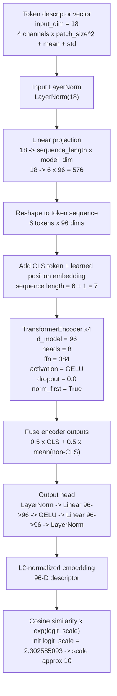

# O4 Pipeline Architecture

O4 是当前 learned stereo objective：主路径使用 `baseline_sgm`，先把左右灰度图编码成 token descriptor，再用轻量 ViT-style `StereoTokenTransformer` 生成左右 token embedding；随后把 cosine score 变成 token cost volume，并复用 O3-style SGM/cleanup 生成正式视差。这个 `a` 目录只保存 pipeline / architecture；正式视差、raw 诊断、confidence 和 error 图统一写入 `results/O4b_transformer/`，metrics/checkpoints 写入 `results/O4c_transformer/`。

下图按当前代码默认参数展开，重点把 ViT-style token encoder 的输入、结构和默认超参数直接写进流程图。

```mermaid
flowchart LR
    subgraph IN[Input]
        A[Middlebury stereo pair]
        B[Load grayscale images\nim0.png / im1.png]
        C[Build content masks\nnon-black valid ROI]
    end

    subgraph CAL[Calibration & Bounds]
        D[Read calib + disparity hints]
        E[Scene-adaptive pixel disparity bounds\ndefault clamp: min=0, max<=288]
        F[Convert pixel bounds to token bounds\ntoken_span = downsample_factor x patch_size = 1 x 2 = 2 px]
    end

    subgraph TOK[Tokenization & ViT-Style Encoder]
        G[Average pooling\ndownsample_factor = 1]
        H[Patch tokenization\npatch_size = 2 -> 2x2 pixels/token]
        I[Descriptor builder\nchannels = intensity + grad_x + grad_y + 3x3 context\nplus token mean + std -> input_dim = 4 x 2^2 + 2 = 18]
        J[5-fold StereoTokenTransformer\nnum_folds = 5]
        K[Encoded left / right token embeddings\nmodel_dim = 96]
    end

    subgraph MATCH[Dense Matching]
        L[Cosine similarity scores\nsoftmax_temperature = 1.0]
        M[Token cost volume = -score\napply content mask + token disparity bounds]
        N[O3-style 4-direction SGM\non token grid]
        O[Left / right token disparity solve\nregression = quadratic]
        P[Raw token diagnostics\ndisp0_transformer_raw / raw_filtered]
    end

    subgraph POST[Post-processing]
        Q[Token LR consistency + confidence margin\nconsistency_threshold = 1.0]
        R[Token cleanup\ntoken_median_filter_size = 3\nspeckle_max_size = 150\nspeckle_max_diff = 1.0]
        S[O3-style fill + weighted median\nfill_invalid_passes = 2]
        T[Upsample token disparity to full resolution\n2 px/token]
    end

    subgraph OUT[Output]
        U[Official outputs\nresults/O4b_transformer/<scene>/disp0.pfm / disp0.png]
        V[Diagnostics\nconfidence.png / error_map.png / raw disparity]
        W[Metrics and checkpoints\nmetrics.csv / fold_summary.csv / o4_model_fold*.pt]
    end

    A --> B
    A --> D
    B --> C
    B --> G
    G --> H
    H --> I
    I --> J
    J --> K
    D --> E
    E --> F
    K --> L
    F --> M
    C --> M
    L --> M
    M --> N
    N --> O
    O --> P
    O --> Q
    Q --> R
    R --> S
    S --> T
    C --> T
    T --> U
    P --> V
    T --> V
    U --> W

    classDef input fill:#eaf3ff,stroke:#5a78b8,color:#1f365c,stroke-width:2px;
    classDef calib fill:#fff2e2,stroke:#be884a,color:#77461a,stroke-width:2px;
    classDef token fill:#edf6ea,stroke:#5e9b63,color:#244b26,stroke-width:2px;
    classDef dense fill:#f2ebff,stroke:#8361b0,color:#4d3375,stroke-width:2px;
    classDef post fill:#ffeaea,stroke:#bf6670,color:#7d2d36,stroke-width:2px;
    classDef output fill:#edf7f4,stroke:#4c8c79,color:#205545,stroke-width:2px;

    class A,B,C input;
    class D,E,F calib;
    class G,H,I,J,K token;
    class L,M,N,O,P dense;
    class Q,R,S,T post;
    class U,V,W output;
```

## StereoTokenTransformer Detail

Visual asset: `results/O4a_transformer/vit_architecture.jpg`

## Processing Notes

- The active execution mode is `baseline_sgm`: trainable Transformer tokens provide learned matching scores, while SGM and cleanup provide the structured stereo regularization.
- Scene disparity bounds are adaptive and derived from O3 calibration hints, then converted from pixel disparity to token disparity according to `downsample_factor * patch_size`. With the current default config this is `1 * 2 = 2` pixels per token.
- The ViT-style encoder is not a generic off-the-shelf ViT-B/16; it is the custom `StereoTokenTransformer` in `codes/o4_torch.py`, with default config `model_dim=96`, `encoder_hidden_dim=384`, `encoder_layers=4`, `heads=8`, and `sequence_length=6` for the current `input_dim=18` token descriptor.
- The token descriptor is built from four local channels: grayscale intensity, horizontal gradient, vertical gradient, and 3x3 mean context, then appends per-token mean and standard deviation.
- Raw Transformer disparity is saved separately as a diagnostic artifact. It is useful for checking whether the learned token prediction itself is reasonable before post-processing.
- `disp0_transformer_raw_filtered.*` preserves the older hard-filtered diagnostic view: LR consistency plus token median, without fill. It is not the formal output.
- The formal `disp0.pfm/png` comes from Transformer/SGM token prediction followed by O3-style cleanup. Confidence is not used as a hard deletion threshold for the official PFM.
- The CUDA path and CPU path follow the same high-level architecture; CUDA keeps heavy token/cost-volume operations on GPU and converts to NumPy for the shared cleanup/output path.

## Default ViT / Token Parameters

- `execution_mode = baseline_sgm`
- `num_folds = 5`
- `downsample_factor = 1`
- `patch_size = 2`
- `context_window_size = 3`
- `token_span = downsample_factor * patch_size = 2` pixels
- `descriptor input_dim = 4 * patch_size^2 + 2 = 18`
- `model_dim = 96`
- `encoder_hidden_dim = 384`
- `encoder_layers = 4`
- `attention heads = 8` because `96 % 8 == 0`
- `sequence_length = min(8, max(4, (18 + 2) // 3)) = 6`
- `disparity_regression = quadratic`
- `softmax_temperature = 1.0`
- `training_epochs = 72`
- `training_learning_rate = 5e-4`
- `training_batch_size = 512`
- `negative_samples = 12`
- `max_training_samples = 60000`
- `weight_decay = 3e-4`

## Optional DINOv2 Alternative

- If `execution_mode` switches to `dinov2_cost_volume`, the main descriptor backbone changes from the custom `StereoTokenTransformer` to DINOv2.
- Current default selector is `facebook/dinov2-base`, which maps to a ViT-B/14 style backbone with patch size `14` and embedding dim `768`.
- `dinov2_input_scale` defaults to `1`; larger values change the effective token density but do not change the backbone width/depth itself.

## Main Artifacts

- `results/O4a_transformer/pipeline_architecture.md`: pipeline / architecture description.
- `results/O4a_transformer/transformer_pipeline.jpg`: PDF/visual full O4 pipeline asset.
- `results/O4a_transformer/vit_architecture.jpg`: core ViT-style `StereoTokenTransformer` architecture diagram.
- `results/O4b_transformer/<scene>/disp0.pfm`: final official O4 disparity.
- `results/O4b_transformer/<scene>/disp0.png`: colorized official preview.
- `results/O4b_transformer/<scene>/disp0_transformer_raw.pfm`: true raw Transformer token disparity after content masking.
- `results/O4b_transformer/<scene>/disp0_transformer_raw_filtered.pfm`: old-style filtered raw diagnostic disparity.
- `results/O4b_transformer/<scene>/disparity_README.txt`: backend, fold, token grid, disparity range, checkpoint, cleanup, and output-source metadata.
- `results/O4b_transformer/<scene>/confidence.png`: confidence visualization.
- `results/O4b_transformer/<scene>/error_map.png`: error visualization when ground truth is available.
- `results/O4c_transformer/metrics.csv`: scene-level MAE/RMSE/Bad-1px summary.
- `results/O4c_transformer/fold_summary.csv`: fold-level summary.
- `results/O4c_transformer/o4_models/o4_model_fold*.pt`: saved Transformer checkpoints.
